<div align="center">

# SmartSpace


### Sistemas de IoT e Móveis (2025/26) — NOVA School of Science & Technology

*A **smart space management system** that automatically adapts the physical environment of each room to the presence and preferences of its users.*

</div>

---

## About the Project

**SmartSpace** is an intelligent indoor space management system that combines **Bluetooth Low Energy (BLE)** for indoor localisation, **ESP32 IoT devices** with sensors and actuators, and a **Flutter Android application**, all coordinated via **Firebase**.

The system detects which zone each user is in, adapts the environment automatically based on sensor data and personal preferences, and resolves conflicts between multiple users through a real-time voting system. It supports two distinct user roles — **admin** and **user** — each with its own dedicated interface and set of permissions.

> 📄 For a comprehensive explanation of the system architecture, implementation details, experiments and results, read the full project report:
>
> **[Access the Full Project Report](report/SmartSpace_Report.pdf)**

---

## Key Highlights

- **BLE-based indoor localisation** with RSSI smoothing via moving average — the phone's BLE sensor is the primary positioning input
- **Real-time environmental automation** driven by LDR (lighting) and DHT22 (temperature/humidity) sensors
- **Multi-user conflict resolution** through a 30-second collaborative voting system with counter-proposals
- **N-to-M architecture** — multiple phones communicate with multiple ESP32 devices via Firebase as a central broker
- **Interactive admin map** with live zone occupancy, animated ESP32 status beacons and user avatars
- **In-app notifications** for zone entry/exit, filtered by user role
- **Full offline resilience** — pending command queue on the app, autonomous sensor-based mode on ESP32

---

## Features

| Feature | Description |
|---------|-------------|
| **BLE Zone Detection** | Automatically detects the user's current zone based on smoothed beacon RSSI |
| **Environmental Automation** | LDR controls lighting intensity; DHT22 triggers buzzer alerts for temperature and humidity |
| **Voting System** | Multi-user conflict resolution with majority vote, counter-proposals and timeout |
| **Adaptive Lighting — AUTO mode** | Blends all present users' light preferences, modulated by ambient luminosity |
| **Absolute Mode** | Admin can lock a zone and override all user commands |
| **Admin Dashboard** | Global view of all zones, sensors, users and ESP32 connectivity |
| **Interactive Zone Map** | Real-time floor plan with occupancy, ESP32 pulse animation and user avatars |
| **User Preferences** | Per-zone lighting intensity, RGB colour, temperature target and do-not-disturb |
| **In-App Notifications** | Animated banners for zone entry/exit, persisted toggle preference |
| **Event Logs** | Full audit trail of all system events stored in Firestore |
| **Energy Monitoring** | Per-zone energy consumption estimation based on actuator uptime and nominal power |
| **Offline Resilience** | Pending command queue on app; ESP32 continues local automations on connection loss |

---

## System Architecture

The SmartSpace architecture follows a **three-layer model** with asynchronous communication mediated by Firebase. There is no direct communication between phones and ESP32 devices — Firebase acts as the central broker.

```
[Android App]  ←──  BLE Scan  ──→  [BLE Beacons × 3]
      ↕
[Firebase RTDB / Firestore / Auth]
      ↕
[ESP32 + Sensors/Actuators]  ←──  WiFi  ──→  Firebase
```

<p align="center">
  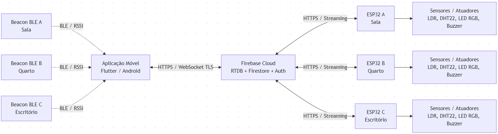
</p>

| Layer | Components | Role |
|-------|-----------|------|
| **Perception & Actuation** | ESP32, LDR, DHT22, LED RGB, Buzzer | Sense, automate and act locally |
| **Cloud** | Firebase RTDB, Firestore, Auth | State sync, persistence, identity |
| **Interaction** | Flutter Android app, BLE beacons | User interface, localisation, commands |

---

## Mobile Application

The app was developed in **Flutter/Dart** for Android, following the **Provider + ChangeNotifier** pattern. Business logic is centralised in `SmartSpaceProvider`; all Firebase communication is delegated to `DatabaseService`.

### Main Components

| Component | Responsibility |
|-----------|---------------|
| `SmartSpaceProvider` | Central state management: automations, voting, preferences, zone tracking |
| `DatabaseService` | All Firebase RTDB and Firestore communication; atomic transactions |
| `BeaconService` | Continuous BLE scanning, RSSI smoothing, zone determination |
| `AuthService` | Authentication, registration, profile loading, role-based access |
| `NotificationService` | In-app notification stream, toggle persistence via SharedPreferences |

---

### Authentication

<p align="center">
  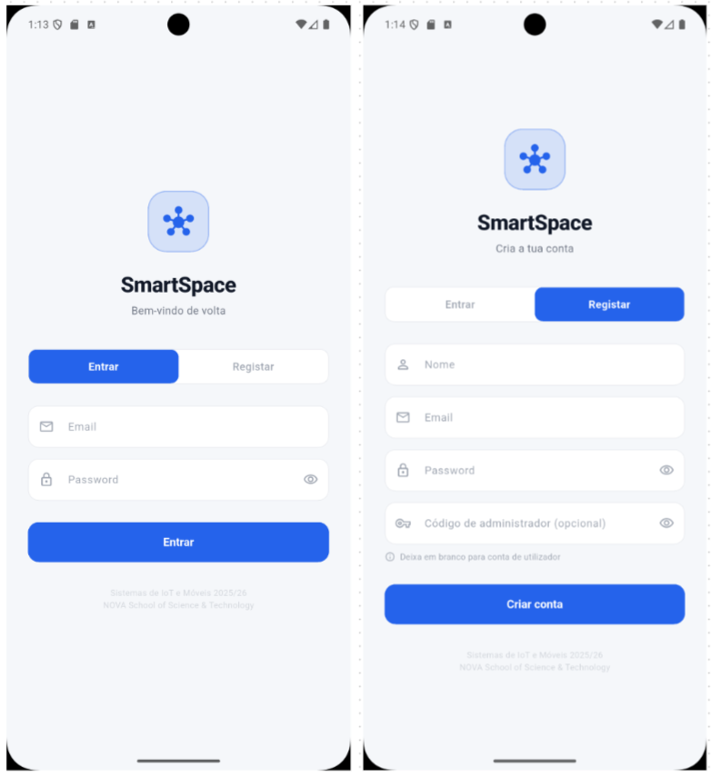
</p>

Login and registration via Firebase Authentication. Registering with the admin code grants the admin role; without it, the user is registered as a regular user. After login, the app loads the user's profile and role from Firestore and presents the corresponding interface.

---

### User Interface

#### Dashboard

<p align="center">
  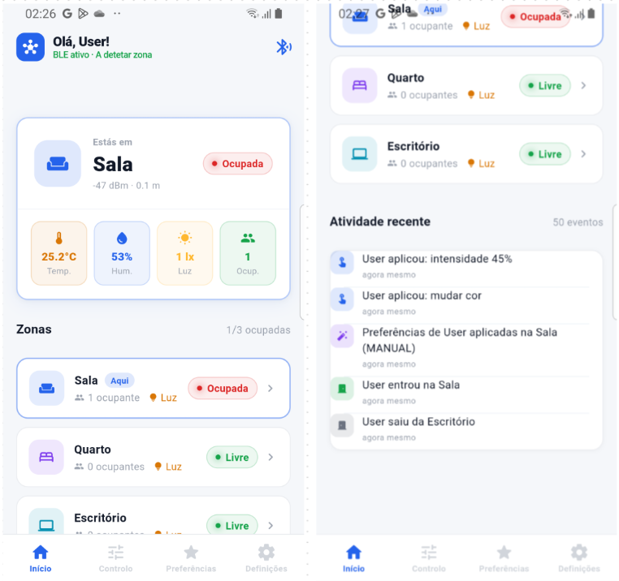
</p>

Shows the currently detected zone, real-time sensor values (temperature, humidity, luminosity), actuator state and the list of users present. Zone detection is fully automatic via BLE and updates in real time.

---

#### Zone Control

<p align="center">
  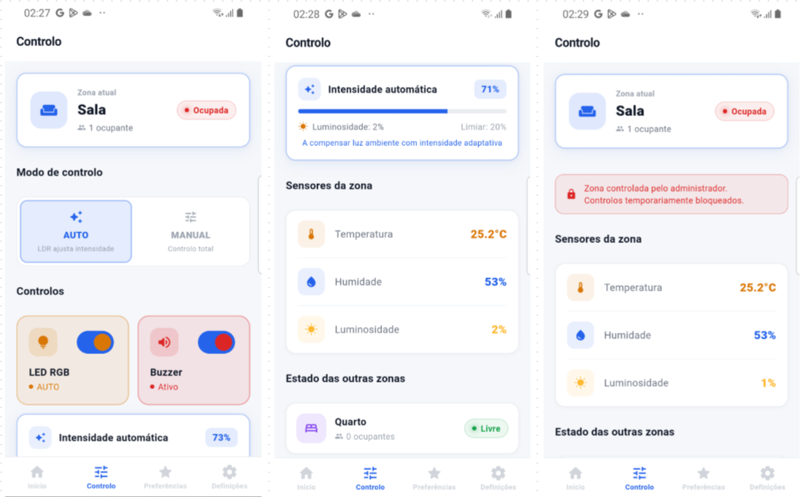
</p>

Allows the user to control the zone's lighting: on/off, intensity slider, RGB colour picker and toggle between AUTO mode (LDR-driven) and MANUAL mode. In AUTO mode, the resulting intensity and colour are the average of all present users' preferences, modulated by the LDR value.

---

#### Conflict Resolution — Voting

<p align="center">
  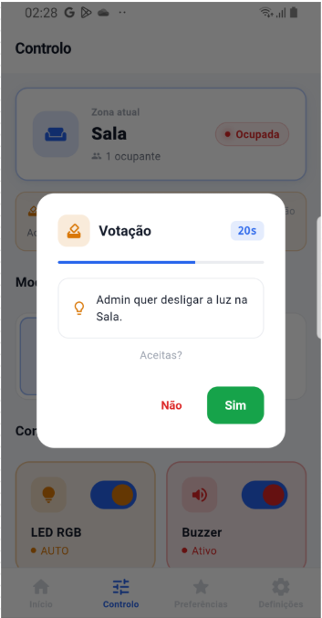
</p>

When multiple users are in the same zone, any manual command automatically triggers a 30-second vote. Each user votes yes or no; if rejected, they can submit a counter-proposal. The final value is the average of the requested value and all counter-proposals. If no one responds, the command is applied after timeout.

---

#### Preferences

<p align="center">
  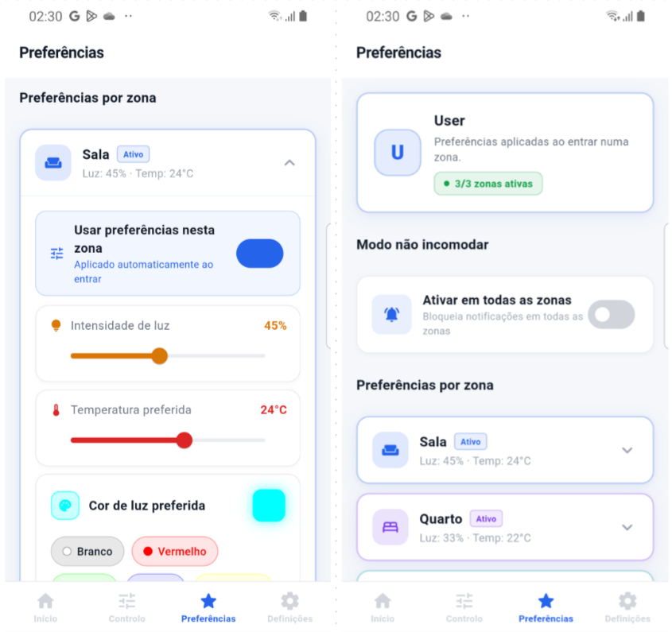
</p>

Each user can define per-zone preferences: preferred light intensity, RGB colour, temperature target and do-not-disturb mode. When entering an empty zone, preferences are applied automatically. When others are present, a vote is triggered.

---

#### Settings

<p align="center">
  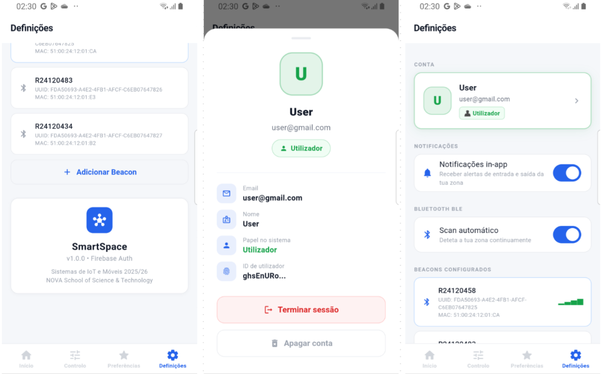
</p>

Account management and in-app notification toggle. The notification preference is persisted locally via `SharedPreferences` and controls whether zone entry/exit banners are displayed.

---

### Admin Interface

#### Dashboard

<p align="center">
  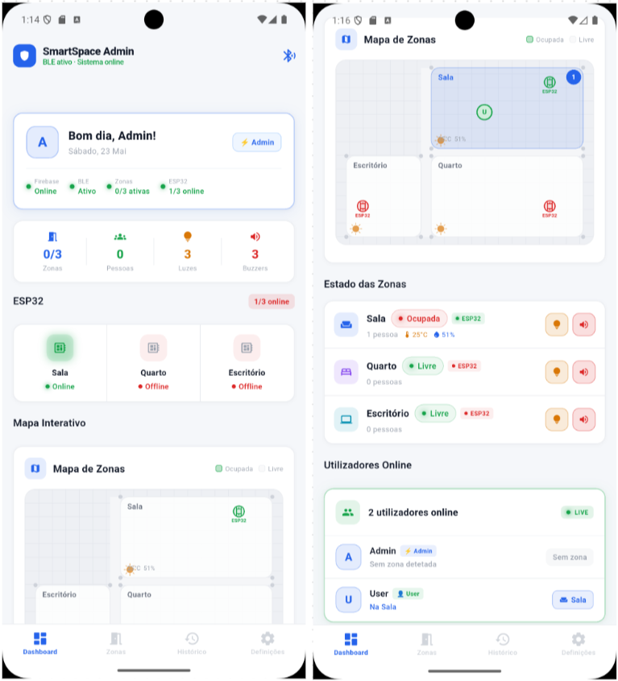
</p>

Global system overview: number of occupied zones, total users online, active lights and buzzers, and ESP32 online/offline status. Provides quick controls for each zone directly from the dashboard.

---

#### Interactive Zone Map

<p align="center">
  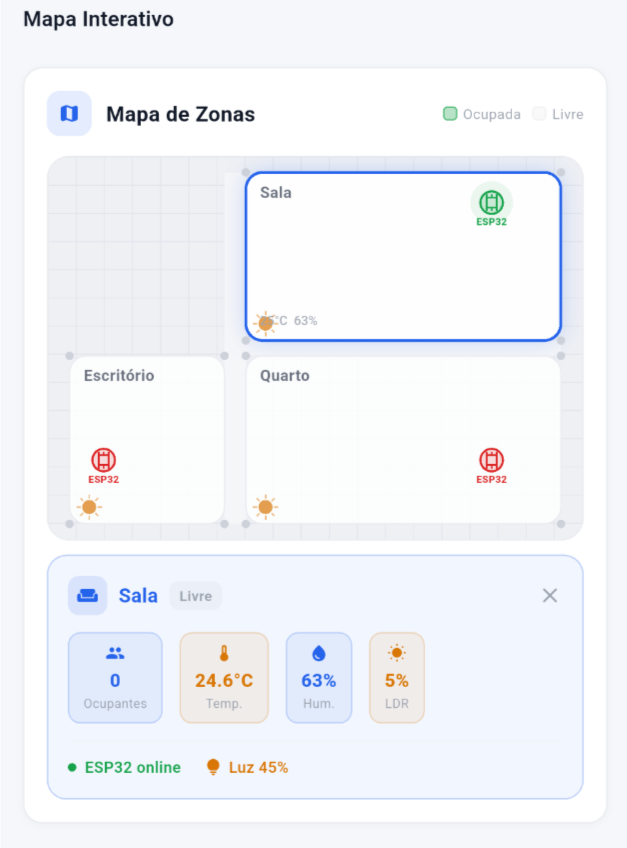
</p>

A `CustomPainter`-based floor plan of the three zones, updated in real time. Each zone changes colour based on occupancy; ESP32 devices are shown with an animated pulse (green = online, red = offline); user avatars appear inside each zone. Tapping a zone expands a detail panel with temperature, humidity, luminosity, light state and present users.

---

#### Event Logs

<p align="center">
  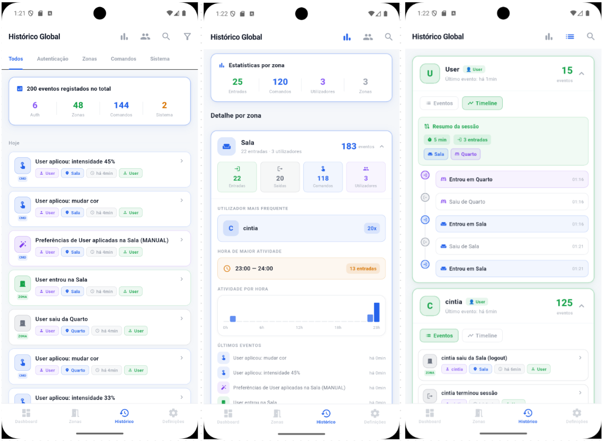
</p>

Full audit trail of all system events stored in Firestore, filterable by category (authentication, zones, commands, system). The admin sees logs from all users and zones; regular users see only their own.

---

#### Admin Settings

<p align="center">
  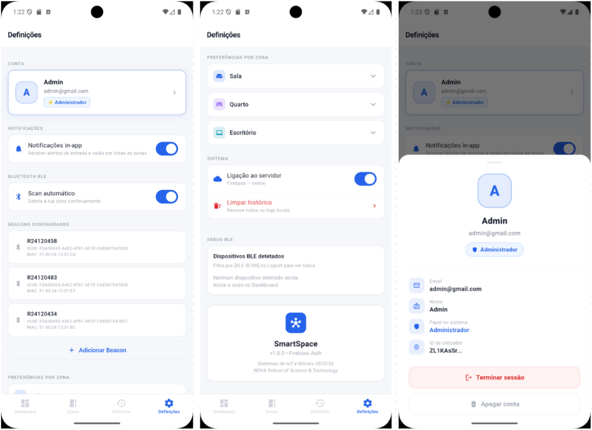
</p>

Advanced configuration: automation thresholds (LDR, temperature, humidity), global system preferences, and notification settings. Admins receive notifications from all zones; regular users only from their current zone.

---

## IoT — ESP32

Each ESP32 unit handles local sensing, automation and actuation autonomously. It communicates with Firebase over WiFi using the **FirebaseESP32 by Mobizt** library, publishing sensor data every 8 seconds and receiving commands via a real-time `MultiPathStream`.

### Sensors & Actuators

| Component | Type | GPIO | Function |
|-----------|------|------|----------|
| DHT22 | Sensor | 32 | Temperature and humidity measurement |
| LDR | Sensor | 34 | Ambient light measurement (0–67% in real environment) |
| RGB LED — lighting | Actuator | 25 / 26 / 27 | Adaptive zone illumination via PWM |
| RGB LED — status | Actuator | 21 / 19 / 18 | Occupancy indicator: green = free, red = occupied |
| Passive Buzzer | Actuator | 14 | Environmental alert at 2400 Hz |

### Circuit

<p align="center">
  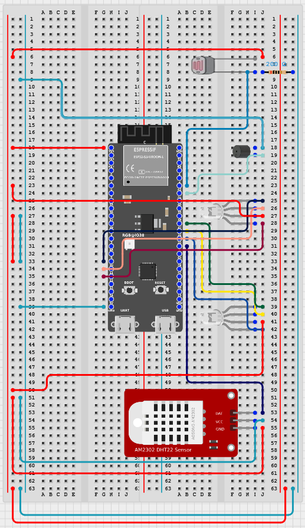
</p>

### Automation Logic

The firmware runs all automations in `checkAutomations()` using **transition guards** — Firebase is only written on state change (false→true or true→false), never on every sensor read. Temperature and humidity guards are independent; the buzzer only silences when **both** alerts have cleared simultaneously (AND condition).

---

## BLE Beacons

Three physical BLE beacons are placed in the monitored zones. The app performs continuous passive scanning and assigns each user to the zone with the highest smoothed RSSI. If no beacon meets the minimum signal threshold, the user is considered outside all monitored zones.

| Zone | Room | Beacon Name | MAC |
|------|------|-------------|-----|
| A | Living Room | R24120458 | 51:00:24:12:01:CA |
| B | Bedroom | R24120483 | 51:00:24:12:01:E3 |
| C | Office | R24120434 | 51:00:24:12:01:B2 |

<p align="center">
  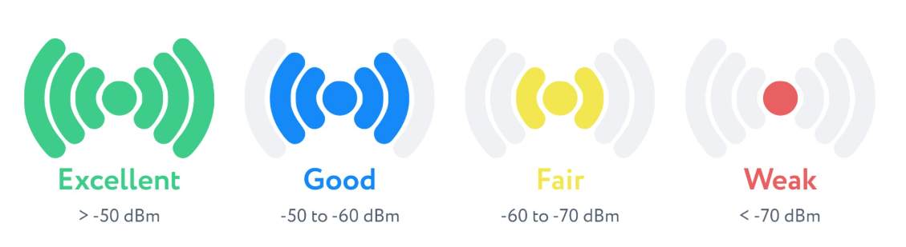
</p>

---

## Firebase Structure

```
smartspace/
  zones/{zoneId}/       ← full zone state: sensors, actuators, occupancy, active poll, automations
  commands/{zoneId}/    ← commands written by the app, read by ESP32 via MultiPathStream
  users/{uid}/          ← online status and current zone of each user
```

<p align="center">
  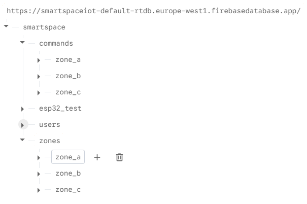
</p>

- **Firestore** — user profiles, per-zone preferences, event logs
- **Firebase Auth** — identity management for users and the ESP32 service account

<p align="center">
  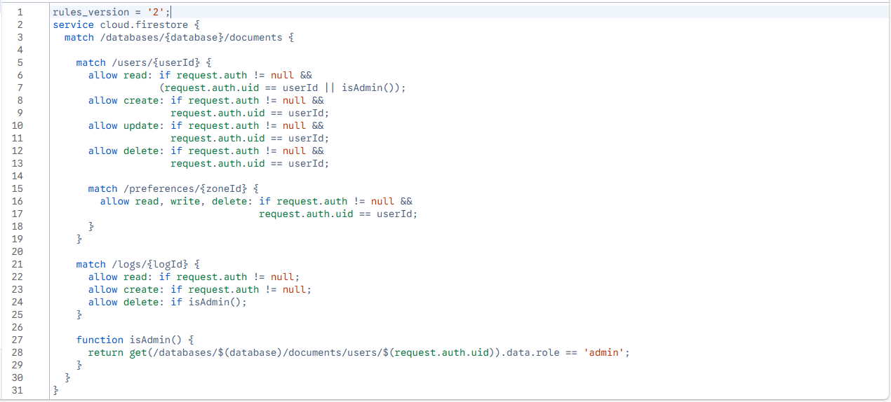
</p>

---

## Setup & Installation

### Flutter App

```bash
# Clone the repository
git clone https://github.com/tomasalexandre30/SmartHome_IoT.git

# Install dependencies
flutter pub get

# Run the app
flutter run
```

> Requires Flutter SDK 3.19+, Android Studio, and a physical Android device with Bluetooth enabled.

### ESP32 Firmware

1. Open the `firmware/` folder in **Arduino IDE**
2. Install the required libraries:
   - FirebaseESP32 by Mobizt
   - ArduinoJson
   - DHT sensor library by Adafruit
   - Adafruit Unified Sensor
3. Set your WiFi credentials and Firebase config in the firmware constants
4. Upload to the ESP32

> ⚠️ Before powering the ESP32, make sure the `smartspace/commands/zone_a` node exists in Firebase RTDB with all fields: `lightOn`, `lightIntensity`, `lightR`, `lightG`, `lightB`, `buzzerOn`.

---

## Technologies

| Technology | Purpose |
|------------|---------|
| **Flutter / Dart** | Mobile application (Android) |
| **Firebase RTDB** | Real-time state sync between app and ESP32 |
| **Firebase Firestore** | Persistent storage: profiles, preferences, logs |
| **Firebase Auth** | User identity and role management |
| **ESP32 + Arduino IDE** | IoT firmware: sensing, automation, actuation |
| **BLE iBeacons** | Indoor localisation via RSSI |
| **FirebaseESP32 by Mobizt** | Firebase communication from ESP32 |
| **ArduinoJson** | JSON parsing on ESP32 |
| **DHT sensor library** | DHT22 temperature and humidity readings |

---

## Authors

This project was developed as part of the **Sistemas de IoT e Móveis** course in the **MSc in Computer Engineering** program at **NOVA School of Science and Technology**.

| Student | Number |
|---------|--------|
| Tomás Alexandre | 73213 |
| Nicolae Iachimovschi | 73381 |
| Henrique Monteiro | 72928 |

> **Course:** Sistemas de IoT e Móveis (2025/26) | **NOVA School of Science & Technology**
